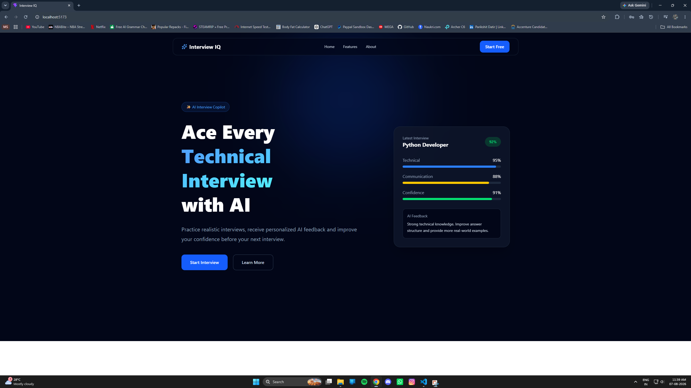
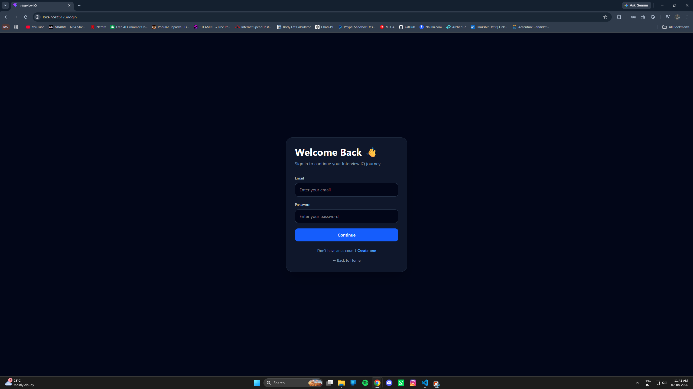
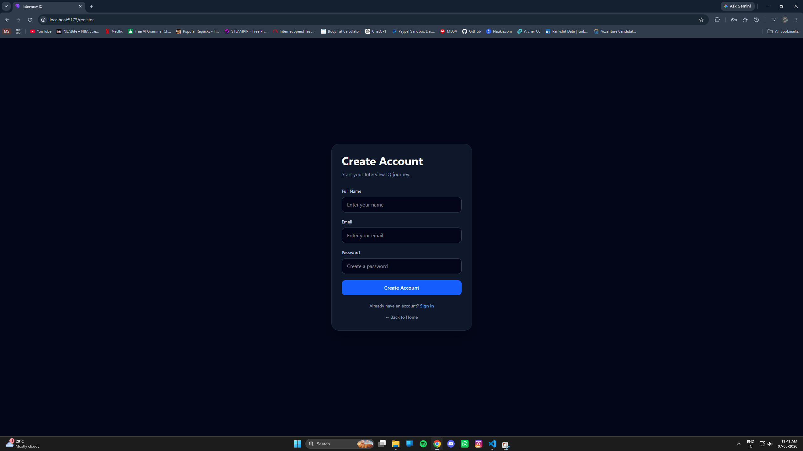
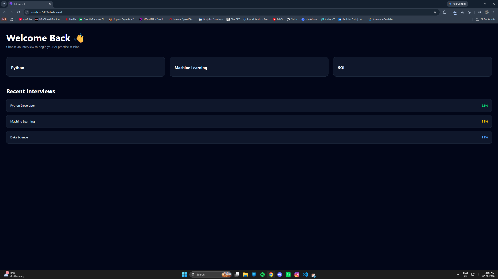
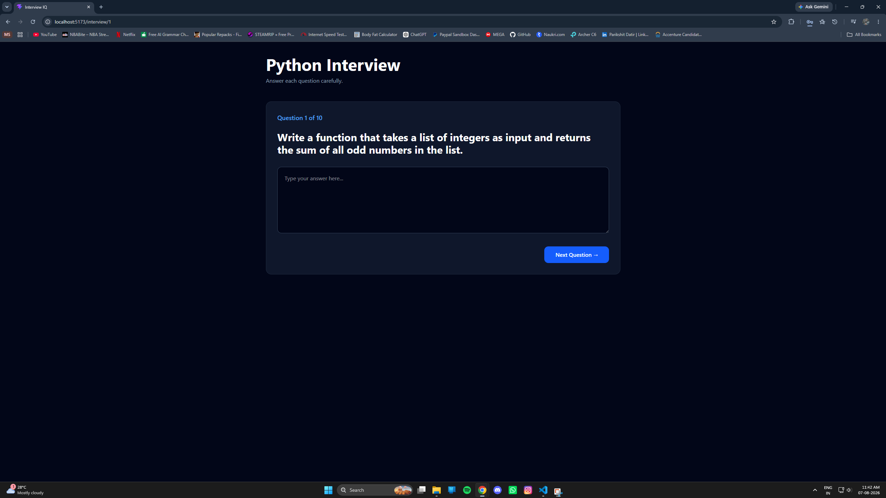
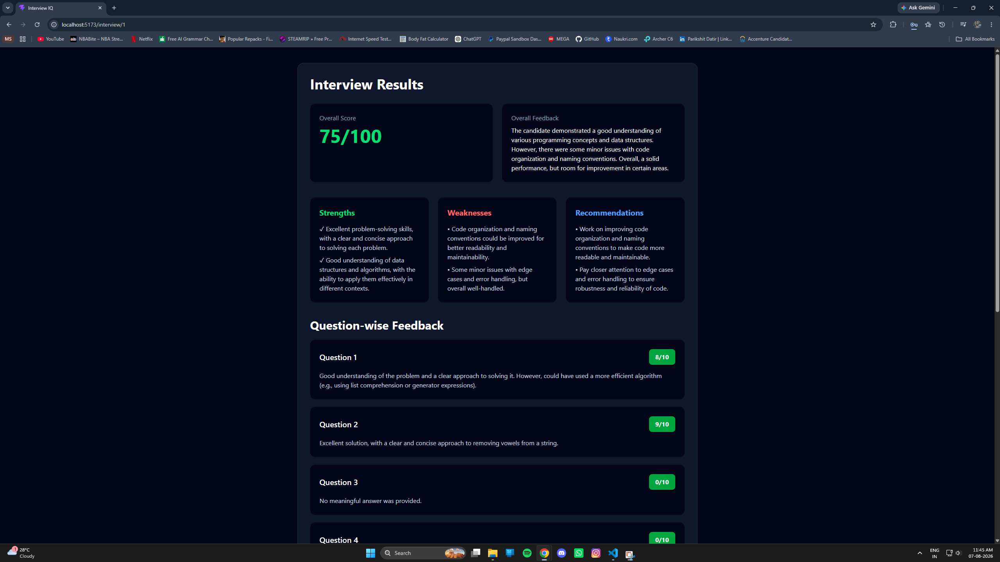

[](https://github.com/parikshitdatir/Interview-IQ/actions/workflows/ci.yml)

# 🤖 Interview IQ

> **AI-powered mock technical interviews with real-time question generation and structured AI evaluation.**

Interview IQ is a full-stack AI interview preparation platform that simulates a technical interview from start to finish. Users can register, sign in securely, choose an interview track and difficulty, receive AI-generated technical questions, submit answers, and receive an AI-generated evaluation with scoring, strengths, weaknesses, ideal answers, and improvement recommendations.

Built with **React + Vite, FastAPI, SQLAlchemy, SQLite, JWT, and Groq (Llama 3.1 8B Instant)**.

<p align="center">
  
</p>

## ✨ Highlights

- 🔐 **JWT-based authentication** — registration and login with password hashing and token issuance
- 🤖 **AI-generated interview questions** — questions are generated dynamically from role, difficulty, and question count
- 🧠 **AI-powered evaluation** — answers are evaluated with structured technical feedback
- 📊 **Interview scoring** — overall score plus question-level feedback
- 🎯 **Strict evaluation logic** — empty, skipped, or extremely short answers are handled separately
- ⚡ **FastAPI REST API** — lightweight backend with clear API endpoints
- 🎨 **Modern React interface** — responsive dark-themed interview experience built with Tailwind CSS
- 🗄️ **SQLite persistence** — SQLAlchemy-backed local database for user and interview data
- 🔒 **Environment-based secrets** — API credentials and JWT secrets are loaded from `.env` and excluded from Git

---

## 🧩 How It Works

```text
┌──────────────────────┐
│   Candidate          │
│ Register / Login     │
└──────────┬───────────┘
           │
           ▼
┌──────────────────────┐
│   React + Vite       │
│   Interview UI       │
└──────────┬───────────┘
           │ HTTP / Axios
           ▼
┌──────────────────────┐
│   FastAPI Backend    │
│   REST API           │
└───────┬────────┬─────┘
        │        │
        │        ▼
        │   ┌──────────────────┐
        │   │ Groq API         │
        │   │ Llama 3.1 8B     │
        │   └────────┬─────────┘
        │            │
        │            ▼
        │   AI Questions /
        │   AI Evaluation
        │
        ▼
┌──────────────────────┐
│ SQLAlchemy + SQLite  │
│ Local persistence    │
└──────────────────────┘
```

### Interview flow

1. Create an account or sign in.
2. Select an available interview track.
3. The backend requests technical questions from Groq based on the selected role and difficulty.
4. Answer the questions one by one.
5. Submit the completed interview.
6. The backend filters non-meaningful responses before evaluation.
7. Groq evaluates the meaningful answers using strict scoring criteria.
8. Interview IQ displays the resulting score and feedback.

---

## 🧠 AI Evaluation Pipeline

Interview IQ uses two AI stages:

### 1. Question Generation

The backend sends the selected **role, difficulty, and requested question count** to the Groq model and requests a JSON response containing the interview questions.

### 2. Interview Evaluation

Candidate responses are processed before being sent for evaluation. Empty answers and very short or skip-style responses can be automatically assigned a zero score, while meaningful answers are passed into the AI evaluation pipeline.

The evaluator uses explicit scoring guidance from **0/10 through 10/10** and asks for strict technical assessment rather than inflated scores.

The result can include:

- Overall score
- Overall feedback
- Strengths
- Weaknesses
- Recommendations
- Question-level scores and feedback
- Ideal answers / improvement guidance

---

## 📸 Product Screenshots

### 🏠 Landing Page


### 🔐 Login



### 👤 Registration



### 📊 Dashboard



### 🤖 AI Interview



### 🧠 Results & Evaluation



---

## 🛠️ Tech Stack

| Layer | Technology |
|---|---|
| Frontend | React 19, Vite 8 |
| Styling | Tailwind CSS 4 |
| Routing | React Router |
| HTTP Client | Axios |
| Icons | Lucide React |
| Backend | FastAPI |
| ORM | SQLAlchemy |
| Database | SQLite |
| Validation | Pydantic |
| Authentication | JWT / python-jose |
| Password Hashing | Passlib + bcrypt |
| AI | Groq API |
| AI Model | Llama 3.1 8B Instant |
| Environment Management | python-dotenv |

---

## 🏗️ Architecture

```text
Interview-IQ/
│
├── assets/                         # README screenshots
│
├── backend/
│   ├── app/
│   │   ├── api/                   # FastAPI route handlers
│   │   ├── auth/                  # JWT + password utilities
│   │   ├── core/                  # Configuration, DB, dependencies
│   │   ├── crud/                  # Database CRUD operations
│   │   ├── models/                # SQLAlchemy models
│   │   ├── schemas/               # Pydantic request/response schemas
│   │   ├── services/              # Groq / AI service logic
│   │   └── main.py                # FastAPI application entry point
│   │
│   ├── .env.example               # Environment variable template
│   └── requirements.txt            # Python dependencies
│
├── frontend/
│   ├── public/                    # Public assets
│   ├── src/
│   │   ├── components/            # Reusable UI components
│   │   ├── pages/                 # Application pages
│   │   ├── services/              # Axios API client
│   │   ├── styles/                # Theme configuration
│   │   ├── App.jsx                # Application routing
│   │   └── main.jsx               # React entry point
│   ├── package.json
│   └── vite.config.js
│
├── .gitignore
├── LICENSE
└── README.md
```

---

## 🔌 API Endpoints

### Authentication

| Method | Endpoint | Purpose |
|---|---|---|
| `POST` | `/auth/register` | Create a new user and issue an access token |
| `POST` | `/auth/login` | Validate credentials and issue an access token |

### Interview & AI

| Method | Endpoint | Purpose |
|---|---|---|
| `GET` | `/interviews` | Return available interview tracks |
| `GET` | `/ai-test` | Verify Groq connectivity |
| `POST` | `/generate-questions` | Generate AI interview questions |
| `POST` | `/evaluate-answer` | Evaluate an individual answer |
| `POST` | `/evaluate-interview` | Evaluate a completed interview |

### Health

| Method | Endpoint | Purpose |
|---|---|---|
| `GET` | `/` | Backend status message |
| `GET` | `/health` | Health check |

Interactive API documentation is available through FastAPI's generated Swagger UI when the backend is running:

```text
http://127.0.0.1:8000/docs
```

---

## 🔐 Security & Environment Variables

Secrets are intentionally **not committed to this repository**.

Create a local environment file at:

```text
backend/.env
```

using the provided template:

```bash
cd backend
copy .env.example .env
```

Then set:

```env
GROQ_API_KEY=your_groq_api_key_here
SECRET_KEY=your_long_random_secret_here
```

> ⚠️ Never commit `backend/.env` or publish API credentials. The repository `.gitignore` excludes `.env` files while keeping `.env.example` available as a safe configuration template.

---

## 🚀 Local Setup

### Prerequisites

Make sure you have:

- Python 3.11+
- Node.js + npm
- A Groq API key

### 1. Clone the repository

```bash
git clone https://github.com/parikshitdatir/Interview-IQ.git
cd Interview-IQ
```

### 2. Configure the backend

```bash
cd backend
python -m venv venv
```

#### Windows

```powershell
.\venv\Scripts\Activate.ps1
```

#### macOS / Linux

```bash
source venv/bin/activate
```

Install dependencies:

```bash
pip install -r requirements.txt
```

Create your environment file:

```powershell
copy .env.example .env
```

Add your Groq API key and a strong random JWT secret to `.env`.

Start the API:

```bash
uvicorn app.main:app --reload
```

Backend:

```text
http://127.0.0.1:8000
```

Swagger docs:

```text
http://127.0.0.1:8000/docs
```

Health check:

```text
http://127.0.0.1:8000/health
```

### 3. Configure the frontend

Open a second terminal:

```bash
cd frontend
npm install
npm run dev
```

Frontend:

```text
http://localhost:5173
```

### 4. Run Interview IQ

Open the frontend URL and complete the flow:

```text
Register → Login → Select Interview → Generate Questions → Answer → Evaluate → Results
```

---

## ✅ Verification

The current project has been manually verified through the complete core flow:

- [x] Backend dependency installation
- [x] Environment variable loading
- [x] FastAPI startup
- [x] `/health` endpoint
- [x] Swagger documentation
- [x] User registration
- [x] User login
- [x] JWT issuance
- [x] AI question generation
- [x] Interview submission
- [x] AI evaluation
- [x] Results rendering
- [x] Frontend lint
- [x] Production frontend build
- [x] Dependency security audit
- [x] Secret scan before publishing

---

## 🗺️ Roadmap

The following are potential future improvements and are **not currently implemented**:

- 📚 Persistent interview history UI
- 📈 Advanced performance analytics
- 📄 Resume analysis
- 🎯 ATS resume scoring
- 🎙️ Voice-based AI interviews
- 🌐 Cloud deployment
- 📱 Further mobile optimization
- 🔄 More configurable interview tracks

---

## 🤝 Contributing

Contributions are welcome.

```bash
git checkout -b feature/your-feature
git add .
git commit -m "feat: describe your change"
git push origin feature/your-feature
```

Then open a Pull Request.

For larger changes, please open an issue first to discuss the proposed improvement.

---

## 👨‍💻 Author

**Parikshit Datir**

- GitHub: [@parikshitdatir](https://github.com/parikshitdatir)
- LinkedIn: Add your LinkedIn profile here

---

## 📜 License

This project is licensed under the **MIT License**. See [LICENSE](LICENSE) for details.

---

<p align="center">
  Built with React, FastAPI, Groq, and a questionable number of cups of chai. ☕
</p>
